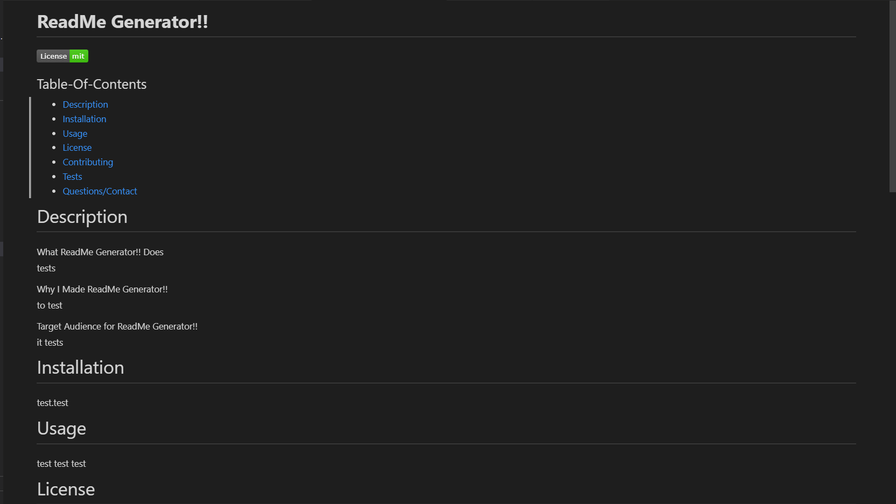
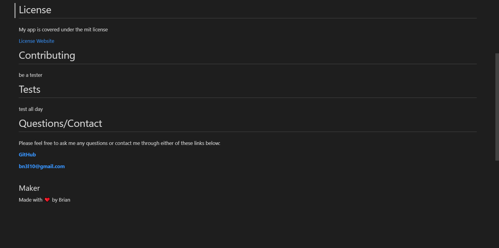

# Professional **README** Generator 🚀

## Table of Contents
* [Description](#description)
* [Installation](#installation)
* [Usage](#usage)
* [Contact](#contact-me)

# Description

This project is a simple, efficient, and professional way to generate a readme.md file without applying any of your own mark down syntax! The Professional ReadMe Generator will generate your readme without forgetting any key sections you want to include in your readme.

This application solves the problem of overlooking your readme and/or creating a subpar readme on the fly. The Professional ReadMe Generator with give you a series of prompts to create your readme with the data provided. Within minutes you can forget about when and how to cross that readme off your list!

# Installation

Prerequisites: [Node.js](https://nodejs.org/en/) &amp; [Inquirer](https://www.npmjs.com/package/inquirer)

* To install the app follow the 'Install Link' below to my repository.
* Clone code to your own local repo.
* Using Terminal, make sure you are in root directory.
* run node index and follow prompts!
* Your new readme will be generated in the dist folder.
**See Usage for Tutorial!**

**[Install Link](https://github.com/brian-nelson10/Professional-ReadMe-Generator)**

# Usage

Run 'node index' in the terminal. You will then be prompted to answer questions about your project, starting with the title. Be sure to capitalize when necessary.
If you decline any yes or no prompts, the generator will return with an auto statement. Once all prompts have been completed, you will see a console log of your answers to all the prompts so you can look over immediately. You will also be notified that your new readme was generated in the dist folder. You can now head over to the dist folder and checkout your new readme to make any changes or simply just move syntax into your own project and you're done!

**[Video Tutorial](https://drive.google.com/file/d/1TESlHAIdz5Ov0Xh5ez83P-y0aHKle46U/view)**

**Screenshots!**

 

# Contribution

Currently seeking those who can provide eyeball time, brain juice, lines of code, code improvements, raising an issue, asking a question, run the communication outside of the code repo, or even stump up some 💰! Please see contact for link!! 

# Contact Me 

Want to contribute?? Drop me a line **[here](mailto:bn3l10@gmail.com)**

Check out my **[GitHub](https://github.com/brian-nelson10)**

## Maker
Made with ❤️ by brian

